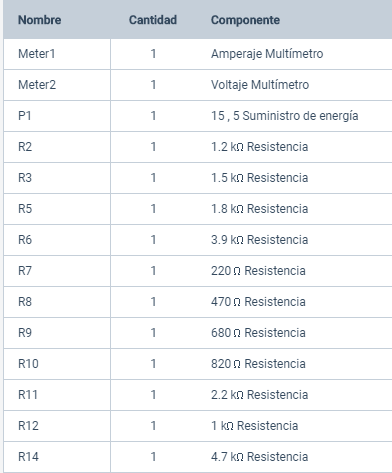

## UNIVERSIDAD DE LAS FUERZAS ARMADAS ESPE

### Práctica de laboratorio N° 6
## Teorema de la Máxima Transferencia de Potencia
**Autores:** Figueroa Erick, León Jipshon,Viracucha William.
### 1. PLANTEAMIENTO DEL PROBLEMA
Al momento de diseñar un circuito eléctrico, por lo general, se busca que el circuito cumpla su trabajo, es decir, que los elementos electrónicos del mismo realicen el trabajo, pero no se toma en cuenta la eficacia para realizar este trabajo, recordando que la potencia representa la tasa de la energía que se convierte en trabajo, existen circuitos que buscan precisamente este objetivo, entregar la máxima potencia de tal forma que el trabajo se realice de ser posible sin pérdida de energía.

Por otro lado, para conocer la potencia que entrega un circuito es necesario analizar todos los componentes del mismo, aunque este proceso se puede simplificar si usamos el [Teorema de Thévenin](https://github.com/erickfi/Practica-5), de esta forma simplificamos el circuito y obtenemos un circuito simplificado para carga variable, su aplicación en la ingeniería es fundamental, ya que es importante en los procesos de automatización donde se busca que las máquinas funcionen a su máxima capacidad, es decir, que tengan una máxima potencia.

### 2. OBJETIVOS
#### Objetivo General
- Comprobar experimentalmente el Teorema de la Máxima Transferencia
#### Objetivos Específicos
- Calcular y comparar los valores de un circuito de Thévenin de forma analítica y experimental.
- Aplicar las *Leyes de Kirchhoff* y el *Teorema de superposición* para analizar y reducir un circuito a un circuito de Thévenin.
### 3. MARCO TEÓRICO
El **Teorema de la Máxima Transferencia de Potencia** estable:
> "La máxima potencia se transfiere a la carga cuando la resistencia de la carga es igual a la resistencia de Thévenin vista desde la carga (RL=RTh).

### 4. DIAGRAMAS
**Diagrama del circuito**

#### 4.1 Análisis Analítico

**Identificación de terminales y corrientes**

**Circuito de Thévenin resultante**

#### 4.2 Análisis Experimental

**Construcción del circuito en [Tinkercad](tinkercad.com) y medición de voltaje y corriente en R=1K Ω**

**Medición del Voltaje de Thévenin VTh**

**Medición de la Resistencia de Thévenin RTh**

**Construcción del Circuito de Thévenin **

### 5. LISTA DE COMPONENTES

### 6. TABLA DE RESULTADOS

***Tabla 1. Valores del Circuito equivalente de Thévenin***
|   VTH(V)  |          |   RTH(Ω)  |             |
|:---------:|----------|:---------:|-------------|
| Calculado | 5.0556 V | Calculado | 298.855 ohm |
| Medido    | 5.06 V   | Medido    | 299 ohm     |
| Error %   | 0,8%     |   Error % | 0,48%       |

***Tabla 2. Comprobación del Teorema de Thévenin***
| Parámetro Eléctrico | Circuito Original |           |         | Circuito   Equivalente Th |        |         |
|:-------------------:|:-----------------:|:---------:|:-------:|:-------------------------:|:------:|:-------:|
|                     | calculado         | medido    | Error % | calculado                 | medido | Error % |
| Voltaje (V)         | 3.89 V            |  3.8926 V | 0,06%   | 3.88 V                    | 3.89V  | 0,25%   |
| Corriente (mA)      | 3.89 mA           | 3.8926 mA | 0,06%   | 3.88 mA                   | 3.89mA | 0,25%   |

### 7. Explicación de Código Fuente

- 1. Arme el circuito tal como se encuentra en el diagrama.
- 2. Mida el voltaje y corriente de la resistencia 5.
- 3. Luego desconecte la resistencia 5 y mida el voltaje del circuito abierto 
- 4. Apague las fuentes y mida la resistencia en el circuito abierto
- 5. Arme el circuito equivalente de Thévenin agregándole la resistencia 5 en serie y configure la fuente y el potenciómetro con los valores del voltaje y resistencia medidos cuando el circuito estaba abierto, al final mida el voltaje e intensidad de corriente de la resistencia de 1kOhm la figura 

### 8. CONCLUSIONES

- Se comprueba experimentalmente el *Teorema de Thévenin* al medir el voltaje en R5= 1k Ohm en el [circuito original](https://github.com/erickfi/Practica-5/blob/master/Img/Diagrama%205.PNG) y al medir el voltaje en los terminales del [circuito de Thévenin](https://github.com/erickfi/Practica-5/blob/master/Img/Cambio%20a%20thevenin.jpg), siendo los voltajes 3.89 V y 3.88 V, respectivamente.
- Cuando se desconecta la carga, midiendo la resistencia y voltaje de Thévenin, siendo estas 299 Ohms y 5.06 V respectivamente y calculando con la teoría los valores del voltaje3.89 V y corriente 3.89 mA en la resistencia 5 se obtienen que son iguales a los medidos experimentalmente.
- Al comparar los valores obtenidos forma analítica y experimental, obtenemos errores menores al 1 % los cuales se asocian a la aproximación de los intrumentos de medición, por lo que, un [circuito de dos terminales](https://github.com/erickfi/Practica-5/blob/master/Img/Diagrama%205.PNG) es equivalente al [circuito de Thévenin ](https://github.com/erickfi/Practica-5/blob/master/Img/Circuito%20Thevenin.jpeg)

### 9. RECOMENDACIONES
- Identificar las fuentes que hay en el circuito y aplicar el correcto análisis para ellas.
- Construya el diagrama para el experimento lo más parecido al diagrama propuesto, para que analizar el circuito sea más fácil.
- En el circuito equivalente de thévenin es necesario utilizar un potenciometro para poder darle un valor de 299 ohmios

### 10. CRONOGRAMA

### 11. REFERENCIAS
- M. A. Sadiku.Fundamentos de circuitos eléctricos. Mc Graw Hill, third edition, 2006
### 12. ANEXOS
- [Cálculos análiticos](https://github.com/erickfi/Practica-5/blob/master/Anexos/C%C3%A1lculos%20Anal%C3%ADticos.pdf)
- [Cómo funciona el circuito](https://www.youtube.com/watch?v=TRDsxjXFfmg&feature=youtu.be)
- [Cómo se implementó el circuito](https://www.youtube.com/watch?v=GO8c0AroBgk&feature=youtu.be)
